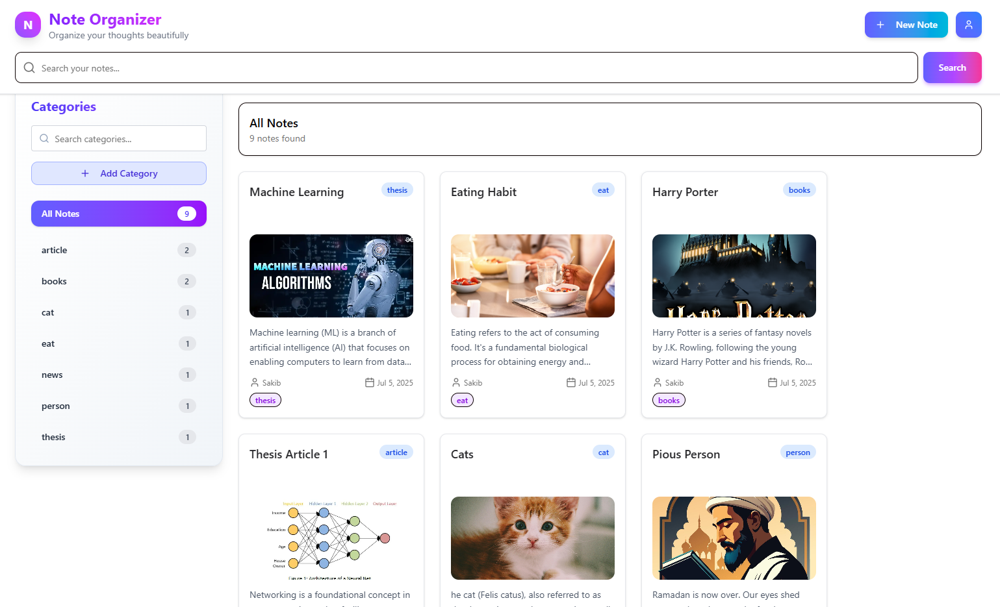
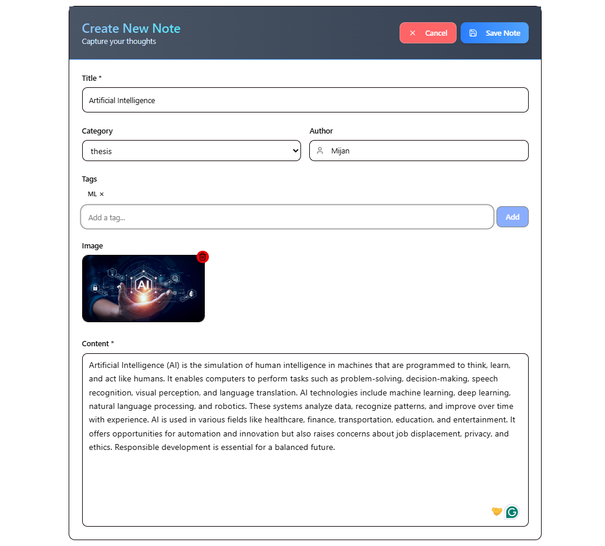

# Note Organizer - Full Stack Application

A modern, full-stack note-taking application built with **React 19**, **Node.js**, **Express**, and **MongoDB**. Features a beautiful UI with real-time search, category management, user authentication, and pagination.

## Login Email : xyz@gmail.com, password : 12345678, project video :





## Features

### Core Functionality Frontend

-   ** Note Management**: Create, edit, view, and delete notes with rich content
-   ** Categories**: Organize notes into categories with automatic count tracking
-   ** Advanced Search**: Real-time search by title, content, or tags with pagination
-   ** Tags**: Add multiple tags to notes for enhanced organization
-   ** User Authentication**: Secure login/register system with JWT tokens
-   ** Pagination**: Efficient pagination with 6 notes per page
-   ** Responsive Design**: Works seamlessly on desktop, tablet, and mobile

### User Experience

-   ** Responsive Design**: Works seamlessly on desktop, tablet, and mobile
-   ** Beautiful UI**: Modern design with indigo-purple gradients and smooth animations
-   ** Fast Performance**: Built with React 19 for optimal performance
-   ** Intuitive Navigation**: Easy-to-use interface with collapsible sidebar
-   ** Smooth Animations**: Elegant transitions and hover effects
-   ** Real-time Updates**: Instant updates when creating, editing, or deleting notes
-   ** Category Counts**: Real-time display of notes count per category
-   ** Smart Filtering**: Filter by category with automatic pagination reset

### Technical Features

-   ** TypeScript**: Full type safety throughout the application
-   ** Design System**: Consistent theming with CSS custom properties
-   ** Component Architecture**: Modular, reusable components
-   ** Modern Stack**: React 19, Vite, Tailwind CSS
-   ** JWT Authentication**: Secure token-based authentication
-   ** Image Upload**: Cloudinary integration for note images
-   ** Real-time Data**: Live updates with proper state management

### Core Functionality Backend

### Authentication & Security

-   **JWT Token Authentication**: Secure token-based authentication
-   **Password Hashing**: bcryptjs for secure password storage
-   **Protected Routes**: Middleware for route protection
-   **User Registration & Login**: Complete auth flow

### Note Management

-   **CRUD Operations**: Create, Read, Update, Delete notes
-   **Pagination**: Efficient pagination with configurable limits
-   **Search Functionality**: Full-text search across titles and content
-   **Category Filtering**: Filter notes by category
-   **Image Upload**: Cloudinary integration for note images
-   **User Ownership**: Notes are associated with specific users

### Category System

-   **Category CRUD**: Full category management
-   **Real-time Counts**: MongoDB aggregation for note counts
-   **Unique Categories**: Prevent duplicate category names
-   **Category-Note Association**: Proper relationships

### Technical Features

-   **RESTful API**: Standard REST endpoints
-   **MongoDB Integration**: Mongoose ODM for database operations
-   **File Upload**: Multer middleware for file handling
-   **CORS Support**: Cross-origin resource sharing
-   **Input Validation**: Zod schema validation
-   **Error Handling**: Comprehensive error responses
-   **Logging**: Morgan for request logging

## Tech Stack

### Frontend

-   **Framework**: React 19 with TypeScript
-   **Build Tool**: Vite
-   **Styling**: Tailwind CSS 4.1
-   **UI Components**: Radix UI + Custom components
-   **Icons**: Lucide React
-   **State Management**: React Hooks (useState, useEffect)
-   **HTTP Client**: Fetch API
-   **Form Handling**: React Hook Form with Zod validation

### Backend

-   **Runtime**: Node.js with Express 5.1
-   **Database**: MongoDB with Mongoose ODM
-   **Authentication**: JWT (jsonwebtoken)
-   **Password Hashing**: bcryptjs
-   **File Upload**: Multer + Cloudinary
-   **Validation**: Zod
-   **CORS**: Cross-origin resource sharing
-   **Logging**: Morgan

### Development Tools

-   **Package Manager**: npm
-   **Development Server**: Nodemon
-   **Environment Variables**: dotenv
-   **Code Quality**: ESLint, TypeScript

## Getting Started

### Prerequisites

-   **Node.js** 18+ and npm installed
-   **MongoDB** database (local or cloud)
-   **Git** for version control
-   **Cloudinary** account (for image uploads)

### Installation

1. **Clone the repository**

    ```bash
    git clone <your-repo-url>
    cd new-project-todo
    ```

2. **Install Backend Dependencies**

    ```bash
    cd backend
    npm install
    ```

3. **Install Frontend Dependencies**

    ```bash
    cd ../frontend
    npm install
    ```

4. **Environment Setup**

    **Backend (.env file in backend directory):**

    ```env
    PORT=5000
    MONGODB_URI=mongodb://localhost:27017/note-organizer
    JWT_SECRET=your-super-secret-jwt-key
    CLOUDINARY_CLOUD_NAME=your-cloudinary-cloud-name
    CLOUDINARY_API_KEY=your-cloudinary-api-key
    CLOUDINARY_API_SECRET=your-cloudinary-api-secret
    ```

    **Frontend (.env file in frontend directory):**

    ```env
    VITE_API_URL=http://localhost:5000
    ```

5. **Start the Development Servers**

    **Backend (Terminal 1):**

    ```bash
    cd backend
    npm run dev
    ```

    Backend will run on: `http://localhost:5000`

    **Frontend (Terminal 2):**

    ```bash
    cd frontend
    npm run dev
    ```

    Frontend will run on: `http://localhost:5173`

6. **Open your browser**
   Navigate to `http://localhost:5173` to see the application

## Project Structure

```
new-project-todo/
├── backend/
│   ├── controllers/
│   │   ├── authController.js      # User authentication logic
│   │   ├── categoryController.js  # Category CRUD operations
│   │   └── noteController.js      # Note CRUD operations
│   ├── middleware/
│   │   ├── auth.js               # JWT authentication middleware
│   │   └── upload.js             # File upload middleware
│   ├── models/
│   │   ├── Category.js           # Category schema
│   │   ├── Note.js               # Note schema
│   │   └── User.js               # User schema
│   ├── routes/
│   │   ├── auth.js               # Authentication routes
│   │   ├── category.js           # Category routes
│   │   └── note.js               # Note routes
│   ├── uploads/                  # Temporary file storage
│   ├── index.js                  # Server entry point
│   └── package.json
├── frontend/
│   ├── src/
│   │   ├── components/
│   │   │   ├── auth/
│   │   │   │   ├── login.tsx     # Login dialog
│   │   │   │   └── register.tsx  # Registration dialog
│   │   │   ├── layout/
│   │   │   │   └── header.tsx    # Main application header
│   │   │   ├── notes/
│   │   │   │   ├── note-editor.tsx    # Note creation/editing
│   │   │   │   ├── note-grid.tsx      # Notes display grid
│   │   │   │   └── note-details-dialog.tsx # Note details modal
│   │   │   └── ui/
│   │   │       ├── category-sidebar.tsx # Category management
│   │   │       ├── note-card.tsx       # Individual note card
│   │   │       ├── pagination.tsx      # Pagination component
│   │   │       └── [shadcn components] # Base UI components
│   │   ├── pages/
│   │   │   └── Index.tsx         # Main dashboard page
│   │   ├── lib/
│   │   │   └── utils.ts          # Utility functions
│   │   ├── hooks/
│   │   │   └── use-toast.ts      # Toast notification hook
│   │   ├── index.css             # Design system & global styles
│   │   └── main.tsx              # Application entry point
│   └── package.json
└── README.md
```

## API Endpoints

### Authentication

```
POST   /api/auth/register         # Register new user
POST   /api/auth/login           # Login user
```

### Notes

```
GET    /api/notes                # Get all notes (with pagination)
POST   /api/notes                # Create new note
GET    /api/notes/:id            # Get specific note
PUT    /api/notes/:id            # Update note
DELETE /api/notes/:id            # Delete note
POST   /api/notes/:id/photo      # Upload note image
```

### Categories

```
GET    /api/categories           # Get all categories with note counts
POST   /api/categories           # Create new category
GET    /api/categories/:id       # Get specific category
PUT    /api/categories/:id       # Update category
DELETE /api/categories/:id       # Delete category
```

### Query Parameters

```
?page=1&limit=6&search=query&category=categoryId
```

## Authentication Flow

1. **Registration**: User creates account with email/password
2. **Login**: JWT token generated and stored in localStorage
3. **Protected Routes**: Token verified on each API request
4. **Logout**: Token removed from localStorage

## Database Schema

### User Model

```javascript
{
  username: String (required, unique),
  email: String (required, unique),
  password: String (hashed),
  createdAt: Date,
  updatedAt: Date
}
```

### Category Model

```javascript
{
  name: String (required, unique),
  createdAt: Date,
  updatedAt: Date
}
```

### Note Model

```javascript
{
  title: String (required),
  content: String (required),
  category: ObjectId (ref: Category),
  author: String (required),
  tags: [String],
  imageUrl: String,
  user: ObjectId (ref: User),
  photo: String,
  createdAt: Date,
  updatedAt: Date
}
```

## Deployment

### Backend Deployment (Heroku/Railway/Render)

1. Set environment variables
2. Connect MongoDB database
3. Deploy using Git integration

### Frontend Deployment (Vercel/Netlify)

1. Set `VITE_API_URL` to production backend URL
2. Deploy using Git integration

### Environment Variables for Production

```env
# Backend
MONGODB_URI=your-production-mongodb-uri
JWT_SECRET=your-production-jwt-secret
CLOUDINARY_CLOUD_NAME=your-cloudinary-cloud-name
CLOUDINARY_API_KEY=your-cloudinary-api-key
CLOUDINARY_API_SECRET=your-cloudinary-api-secret

# Frontend
VITE_API_URL=https://your-backend-url.com
```

## Testing

### Backend Testing

```bash
cd backend
npm test
```

### Frontend Testing

```bash
cd frontend
npm run test
```

## Available Scripts

### Backend

```bash
npm run dev      # Start development server with nodemon
npm start        # Start production server
npm test         # Run tests
```

### Frontend

```bash
npm run dev      # Start development server
npm run build    # Build for production
npm run preview  # Preview production build
npm run lint     # Run ESLint
```

## Contributing

1. Fork the repository
2. Create a feature branch (`git checkout -b feature/amazing-feature`)
3. Commit your changes (`git commit -m 'Add amazing feature'`)
4. Push to the branch (`git push origin feature/amazing-feature`)
5. Open a Pull Request

## Acknowledgments

-   **React Team** for the amazing framework
-   **Tailwind CSS** for the utility-first CSS framework
-   **Radix UI** for accessible component primitives
-   **Lucide** for beautiful icons
-   **MongoDB** for the flexible database
-   **Cloudinary** for image hosting

## Support

If you have any questions or need help:

1. Check the [Issues](../../issues) page
2. Create a new issue with detailed description
3. Contact the maintainers

---

**Made with by [Mijanur Rahman]**

_This project demonstrates modern full-stack development practices with React, Node.js, and MongoDB._
